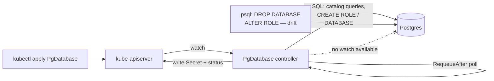

# A control plane for something that is not Kubernetes: reconciling Postgres databases with no watch API

**Repo slug:** `pg-database-operator`
**Pattern:** A1 — control planes and reconciliation, with A6 (data layer internals)
**Surface:** local `kind` + Postgres + Go, benchmarked against Crossplane `provider-sql`
**Effort:** full weekend (the biggest of the three)

---

**Competencies:**
- *Declarative APIs over systems that do not push events* — "how do you build a reconcile loop when the thing you manage has no watch, only queries?"
- *Polling economics* — "what does drift detection cost when every check is a query against the system you are managing?"
- *Deletion as a first-class problem* — "the external resource cannot be deleted right now. What does your finalizer do, and for how long?"
- *Build vs adopt* — "there is already a provider for this. Defend writing your own, or defend not writing it."

**Where this shows up:** Crossplane providers, Cluster API infrastructure providers, cloud operators, every internal "database as a service" platform, and every team that has ever wrapped a vendor API in a CRD. In interviews it is the "design a declarative API for X" question, where X is deliberately not Kubernetes.

**Maturity:** the Kubernetes side is `kubebuilder`, which is as settled as it gets. The comparison target, `crossplane-contrib/provider-sql`, has managed resources for PostgreSQL `Database`, `Role`, `Grant` and `Extension`, and a documented install path. It also has real open issues — which is useful, not a problem: a known limitation in a mature project is exactly the kind of evidence a build-vs-adopt ADR needs.

### Where to read more

*(This is the final part of the `Background — the concept explained from scratch` section required by the current project instructions. The rest of that section is not yet written — see the note at the end of this file.)*

| Source | What it is good for | Time |
|---|---|---|
| **Crossplane docs — Crossplane Pods** https://docs.crossplane.io/latest/guides/pods/ | The clearest official statement of the constraint this whole project is about. **Backs the claims in this brief** that managed resources use a Kubernetes watch for spec and deletion events but rely on **polling** to detect changes in the external system; that the default poll rate is one minute, changed with `--poll-interval` or overridden per resource with the `crossplane.io/poll-interval` annotation; that `crossplane.io/reconcile-requested-at` forces an immediate reconcile; and that a separate global sync re-checks everything hourly by default. | 20 min |
| **`crossplane-contrib/provider-sql` — README** https://github.com/crossplane-contrib/provider-sql | The comparison target's install path and its own stated tradeoff. **Backs the claims** that it reconciles managed resources every 10 minutes specifically to reduce load on the managed databases, that PostgreSQL support covers `Database`, `Role`, `Grant` and `Extension`, and that a `ProviderConfig` reads username, password, endpoint and port from a Kubernetes Secret. Check the current package tag and registry against the README before installing — the registry moved. | 20 min |
| **`crossplane-contrib/provider-sql` — issue #240, "(postgresql) Grant privileges on database — external resource existence never confirmed"** https://github.com/crossplane-contrib/provider-sql/issues/240 | A real, documented case where a managed resource never reaches ready state because the validation query expects an exact match against the granted privilege set. This is the single most useful citation in the build-vs-adopt ADR: it is concrete evidence about how hard "observe the external state correctly" actually is. | 10 min |
| **PostgreSQL docs — DROP DATABASE** https://www.postgresql.org/docs/current/sql-dropdatabase.html | The mechanics behind the deletion experiment. **Backs the claim** that the command fails while anyone else is connected to the target database, and that it cannot run inside a transaction block. Read the `FORCE` option carefully — it attempts to terminate existing connections, but the docs state it does not terminate when prepared transactions, active logical replication slots or subscriptions are present. That exception is exactly where a finalizer that assumes `FORCE` always works will hang. | 10 min |
| **Kubernetes blog — "Using Finalizers to Control Deletion" (14 May 2021)** https://kubernetes.io/blog/2021/05/14/using-finalizers-to-control-deletion/ | The deletion mechanics your finalizer sits on: `deletionTimestamp`, why the object stays visible, and who is responsible for removing the finalizer. Read before writing phase 2 step 4, because getting this wrong leaves objects stuck in a way that is annoying to clean up in a shared cluster. | 20 min |

All five links checked live on 22 August 2026.

---

### The system

A CRD, `PgDatabase`, describing a logical database inside a Postgres instance: database name, owner role, required extensions, and a deletion policy. A controller reconciles it against a real Postgres server: creates the role, creates the database, installs extensions, writes the generated credentials into a Secret, and reports observed state in `status`.

Postgres does not push change events. There is no watch. So the controller must **poll** — and every poll is a query against the database you are managing. That constraint is the whole project.

The dotted line is the design problem: the controller can never be told that something changed. It can only ask, on a schedule it chooses.

---

### Stack

| Tool | Why this one |
|---|---|
| `kind` + Postgres (a StatefulSet, or Docker Compose alongside) | Postgres is the lab's stateful anchor for the whole year. Put it in the cluster now and reuse it every month after. |
| `kubebuilder` (latest v4) + Go (v1.24.6+ per the Quick Start) | Same scaffold as project 1. |
| `pgx` or `database/sql` + `lib/pq` | One pooled `*sql.DB` per Postgres endpoint. Pooling matters here — see stuck-risk 2. |
| Crossplane + `crossplane-contrib/provider-sql` | The comparison target. Install via a `Provider` manifest and a `ProviderConfig` pointing at a Kubernetes Secret holding username, password, endpoint and port. |
| `pg_stat_activity` / `pg_stat_statements` | How you measure what polling actually costs the database. |

---

### Build phases

**Phase 1 — baseline running (≤2h)**

1. Postgres running in `kind`, reachable, with a superuser secret.
2. `kubebuilder create api --group lab --version v1alpha1 --kind PgDatabase`.
3. Controller connects to Postgres on startup and logs the server version. No reconcile logic yet.

**Done when:** `make run` prints the Postgres version it read over SQL.

**Phase 2 — the reconcile loop (1–2 evenings)**

1. `Reconcile` reads desired state, then **observes** actual state with catalog queries (`pg_database`, `pg_roles`, `pg_extension`).
2. Create what is missing. Make every operation idempotent — check first, then act, and never rely on `IF NOT EXISTS` alone to hide a logic bug.
3. Generate a password, write it to a Secret, and never log it.
4. Add a finalizer. On delete, honour `spec.deletionPolicy`: `Delete` drops the database, `Orphan` leaves it and just removes the finalizer.
5. Return `RequeueAfter` to set the poll interval, and make it configurable.
6. Set status conditions: `Ready`, plus `lastObservedTime`.

**Done when:** you `DROP DATABASE` by hand in `psql` and the controller recreates it without you touching the CR.

**Phase 3 — the experiment (half day)**

Install Crossplane and `provider-sql`, point it at the same Postgres, and create the equivalent `Database` and `Role` resources. Then run the same drift against both.

---

### The experiment

**What I measure**

1. **Drift detection latency vs poll interval.** Drop the database in `psql`; time until it exists again. Your controller at `RequeueAfter` = 10s, 1m, 10m. `provider-sql` at its default and at a lowered interval. Ten runs per cell.
2. **Query load on the managed database**, per managed resource per hour, at each poll interval. Count from `pg_stat_statements`, or sample `pg_stat_activity`. This is the number nobody publishes and it is the heart of the article.
3. **Connection behaviour under fan-out.** Create 50 `PgDatabase` objects at a 10-second interval. Watch connection count. Find the point where the controller becomes a load generator against the thing it is supposed to be managing.
4. **Deletion under contention.** Delete a `PgDatabase` while a client holds an open connection to that database, and time how long the finalizer blocks.
5. **Behaviour when Postgres is unreachable.** Stop Postgres mid-reconcile. Record: what `status` says, how the backoff behaves, and whether the controller hot-loops.

**Expected result**

Detection latency tracks the poll interval almost exactly, because there is nothing else that can trigger a check. Query load scales linearly with (number of resources ÷ poll interval), which sounds obvious written down and is routinely forgotten in design reviews.

**What would be surprising — and this is the article**

Three candidates, and at least one of them will land.

- **The deletion deadlock.** Postgres refuses to drop a database that has active connections. A finalizer that retries `DROP DATABASE` forever leaves the Kubernetes object stuck in `Terminating` with no error visible to whoever ran `kubectl delete`. That is a genuinely nasty production failure mode, it is easy to reproduce on purpose, and the fix is a design decision rather than a code fix. Modern Postgres offers a `FORCE` option that attempts to terminate existing connections — but the docs are explicit that it does not terminate when prepared transactions, active logical replication slots or subscriptions are present. So the real question is what your controller does when even `FORCE` fails: refuse and surface a condition, time out and orphan, or block forever. Pick one on purpose and defend it in the ADR.
- **The polling cost crossover.** There is an interval below which your control plane is a meaningful fraction of the load on the database it manages. Finding that number for a trivial workload — and pointing out that it scales with resource count, not with change rate — is the whole argument for event-driven external systems.
- **The comparison is not the one you expect.** `provider-sql` reconciles managed resources on a ten-minute cycle by default. Crossplane's own docs are explicit that managed resources watch Kubernetes for spec changes but rely on **polling** to detect changes in the external system, at a default poll rate of one minute, adjustable with `--poll-interval` or a per-resource annotation, with an additional global sync every hour. So the honest comparison is not "mine is faster" — it is that both implementations face the identical constraint and the interesting engineering is entirely in what you do about it.

---

### Failure modes to induce

- `DROP DATABASE` behind the controller's back (baseline drift).
- `ALTER ROLE ... NOLOGIN` behind the controller's back — drift in a field you may not even be checking.
- Delete the CR while a connection to that database is open (the finalizer deadlock).
- Stop Postgres entirely during a reconcile.
- Create 50 resources at a 10-second interval until the connection pool or `max_connections` gives out.
- Point two `PgDatabase` objects at the same physical database name and see which one wins.
- Restore a database by hand while the controller thinks it is absent, mid-create.

---

### Artifact

- Public repo `pg-database-operator`.
- **Table 1:** drift detection latency × poll interval × implementation (yours vs `provider-sql`).
- **Table 2:** queries and connections against Postgres per managed resource per hour, by interval.
- **Table 3:** deletion outcomes — clean, blocked, orphaned — with the time each took.
- **Mermaid diagram:** the observe-then-act loop and where the missing watch forces a poll.
- **`artifact-adr.md`:** write an operator, or adopt an existing provider, for an external system with no watch API.

---

### Prerequisites and stuck-risk

**You must already know:** Go, SQL and Postgres administration (roles, grants, catalogs), and CRDs. Doing project 1 first makes this much smoother, because the scaffold and the reconcile mechanics are then not new.

**Stuck-risk 1 — getting Crossplane and `provider-sql` wired up in `kind`.** The chain is Provider install → provider revision becomes active → `ProviderConfig` referencing a Secret with the right key names → managed resources. Any link can quietly not happen, and there is a known open issue where a Postgres `Grant` never reaches ready state because the privilege comparison expects an exact match against the granted set.
*Fallback:* drop the live comparison. Measure your own controller across all intervals, and compare against `provider-sql`'s **documented** behaviour, cited and dated, with an honest note that you did not run it. The article survives this completely — most of its value is in your own numbers. Do not spend the weekend fighting the install.

**Stuck-risk 2 — connection exhaustion turns into a blocked laptop rather than a result.** At a 10-second interval across 50 resources, a naive one-connection-per-reconcile design will hit `max_connections` and lock you out of `psql` too.
*Fallback:* use a single shared pooled `*sql.DB` with an explicit `SetMaxOpenConns` from the start, and add a `make nuke-connections` target that runs `pg_terminate_backend` so you can always recover. Then treat exhaustion as a **measured result** you produce on purpose, not an accident you recover from.

**Stop line — the minimum publishable result:** your controller creating and dropping one database and role, detecting one class of hand-made drift, with the poll-interval × detection-latency × query-load table for your own implementation, plus the deletion deadlock reproduced once. The Crossplane comparison is a bonus, not a requirement.

---

### The article that falls out

**Title:** "Building a control plane for something that cannot be watched: reconciling Postgres from a Kubernetes CRD"

**Hook:** Kubernetes controllers feel instant because everything inside Kubernetes pushes events. Point one at a database and that illusion disappears immediately.

**Spine:**
1. Why the reconcile pattern still applies to systems with no watch, and what changes when it does.
2. Observe, then act: writing an idempotent reconcile against SQL catalogs.
3. The polling bill — detection latency and query load as two ends of the same dial.
4. Deletion is the hard part: the finalizer that could not drop the database.
5. Build or adopt — what an existing provider gives you, and what it costs you.

---

### How it compounds

Leaves Postgres running in the lab as the permanent stateful anchor, with a controller that can provision databases on demand — which is directly reusable in month 3 (outbox and change data capture), month 6 (multi-tenancy, where per-tenant databases become the isolation unit) and month 10 (high-load architecture). Extends project 1 by taking the same pattern outside Kubernetes, which is the step that turns "I can write an operator" into "I can design a control plane".

---

### Handoff notes

**Repo:** `pg-database-operator` (public, personal account, MIT). Synthetic data only; the Postgres instance is a throwaway in `kind`.
**Staff artifact:** `docs/artifact-adr.md` — build vs adopt for external-system control planes.

**Must be captured in `docs/build-log.md` while building:**
- The exact SQL error text when `DROP DATABASE` is refused, and what the Kubernetes object looked like at that moment (`kubectl get -o yaml`, including finalizers and deletionTimestamp).
- Every place you discovered the reconcile was not idempotent, and how you found out.
- The full Crossplane/`provider-sql` install sequence including anything that did not work, with error text — this is the single most useful section for readers and it is unreconstructable afterwards.
- The connection count at the moment things fell over, and what you were doing.
- Any drift you realised the controller was **not** checking for. That list is the honest limitation section of the article.

**`docs/measurements.md`:** three tables, ten runs per timing cell, with the exact command or SQL that produced each number and the poll interval clearly labelled.

**`docs/raw/`:** `pg_stat_statements` dumps before and after each sweep, `pg_stat_activity` samples during the fan-out test, and the raw controller logs from the deletion deadlock.

---

---

### Still to write before this becomes `docs/brief.md`

The current project instructions require a **`Background — the concept explained from scratch`** section, sitting after *Maturity* and before *The system*, in eight parts: what it actually is (from first principles), the problem it solves, how it works mechanically, a vocabulary table, what to understand first, related and adjacent topics, common misconceptions with corrections, and where to read more. Only the last part exists above. The other seven are not yet written.

Write them before copying this file into the repo as `docs/brief.md`, since that file is frozen on day one and also serves the article writer and anyone arriving at the repo from the article.
