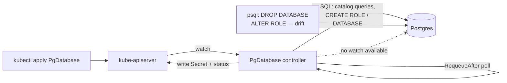
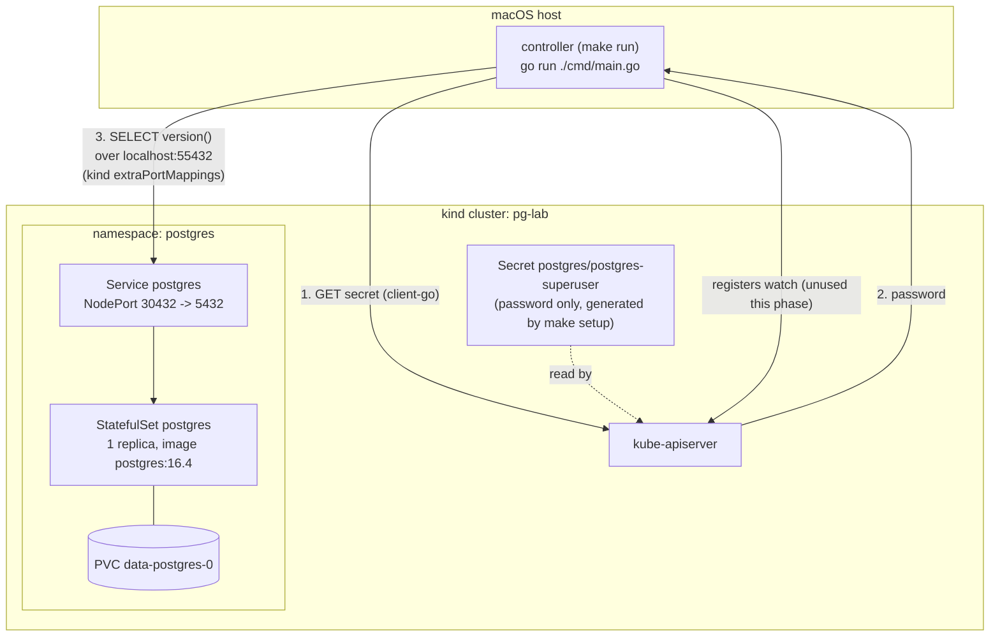

# diagrams

## The design problem (from `docs/brief.md`)

The dotted line is the whole point of this project: the controller has no way to be told something changed in Postgres, only to ask.

## Phase 1 as-built

What actually exists right now: Postgres running in `kind`, and the controller — on the host, not yet deployed in-cluster — connecting to it once at startup. There is no `PgDatabase` reconciliation yet; this diagram will grow a `Reconcile()` loop in Phase 2.

**Reading it:** step 3 is the only Postgres traffic this phase produces — one `SELECT version()` per controller startup, no polling loop yet. The host reaches the cluster's `NodePort` Service through the port mapping baked into `deploy/kind-config.yaml` (container port `30432` → host port `55432`), because the controller runs as a plain host process in this phase, not as a Pod inside the cluster's network.
